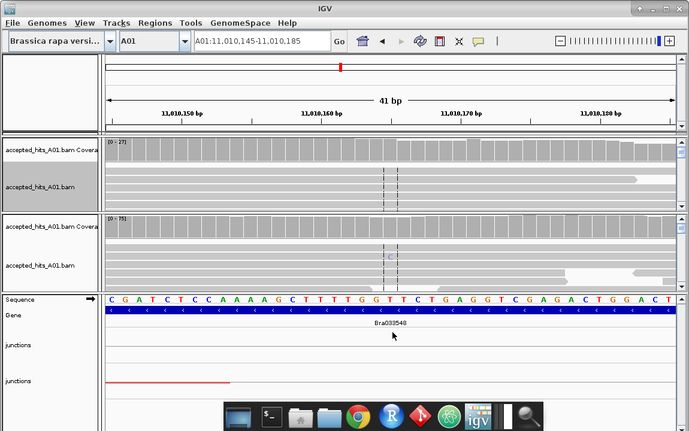
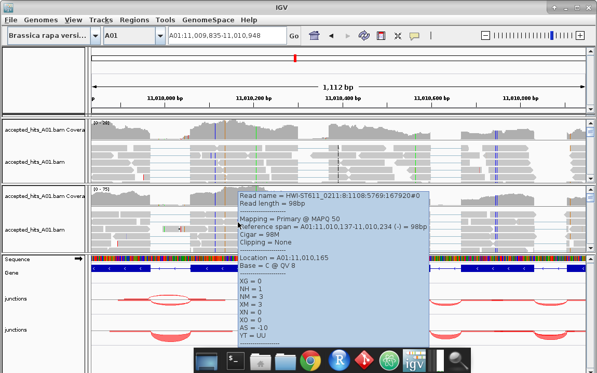
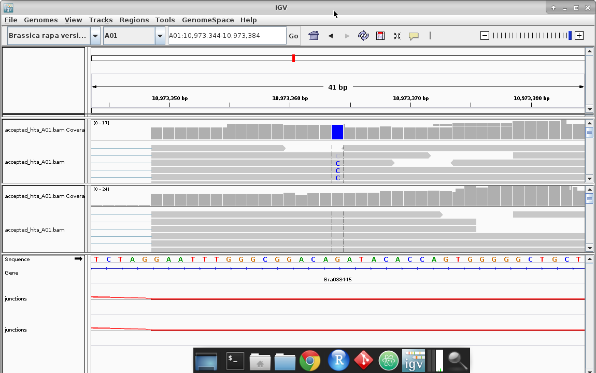
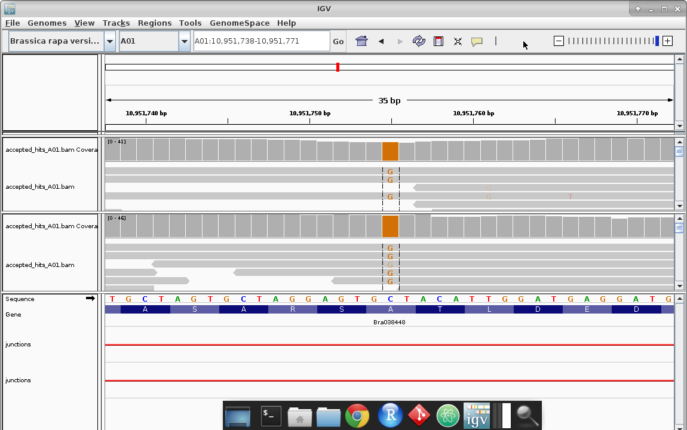
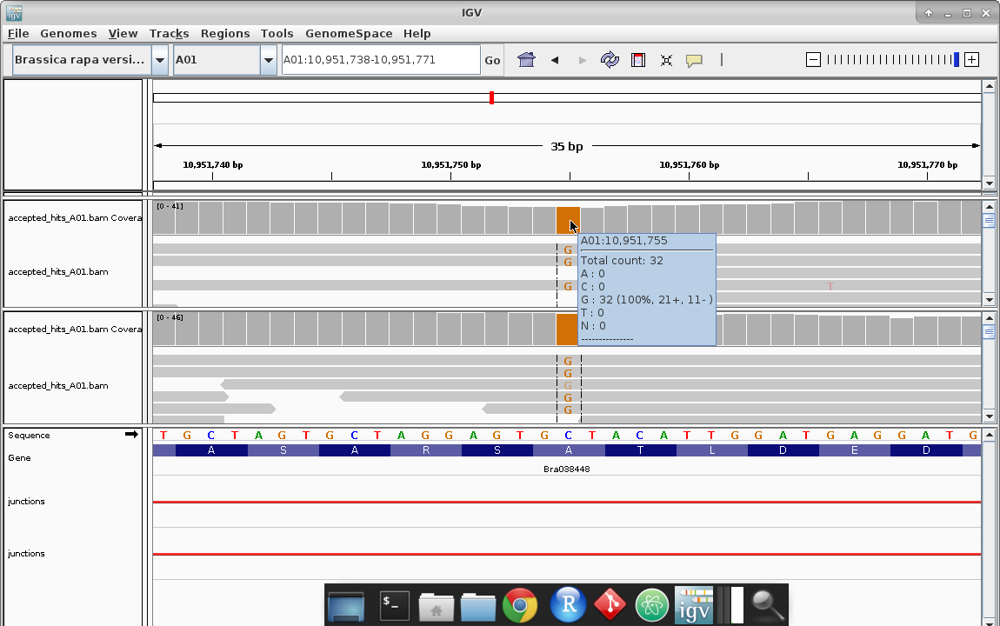
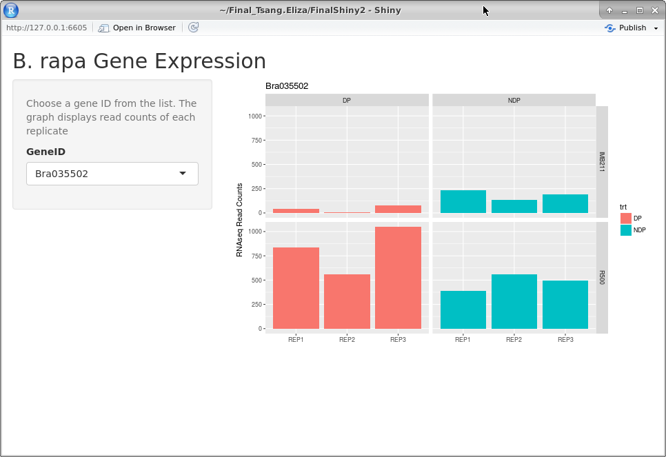

# BIS180L Final Exam


__Spring, 2017__  
__Available June 6, 2017__  
__Due June 12, 9:00 AM__  

__88 points total__

__Student Name:__ Eliza Tsang

__Student ID:__ 999606858

## Question 0 (4 points)

Throughout this assignment, you code should have helpful comments and appropriate variable names.

1 pt for helpful comments  
1 pt for appropriate variable names  
2 pts for well formatted Rmarkdown and resulting html  

## Question 1 (10 points)
**Start IGV.  Load __both__ the IMB211 and R500 tophat "Accepted Hits" bam files from Assignment 5 into the same IGV session.  If you no longer have the files see [the IGV lab](http://jnmaloof.github.io/BIS180L_web/2017/05/16/Illumina-Day-2/) to download again. (For the screenshots requested below position the base of interest between the two black lines in the middle of the viewer). Remember that as long as you put your image files in your git directory that you can include screenshots in your knitted Rmd with code like this (but change `eval=FALSE` to `eval=TRUE`):**

```{r, eval=FALSE} 
knitr::include_graphics("Final2017Shiny2.png")
```


__a. (2 points)__ **Find a read where an apparent polymorphism is likely due to sequencing error.**  
* Take a screenshot and include it in your knitted file.
* Why do you think this is due to a sequencing error?  Note: you can determine the quality of the base by hovering the pointer over it; look for the line similar to "BASE = A @ QV 30".

```{r, eval=FALSE}

#base of interest between the black lines


#more information on the same SNP, the pointer is on the base of interest
```

The QV (Quality Value) estimates the probablity of the error in the sequence. 

Quality Value = -10log10(Probability of error)

For this base, it has QV=8. At QV=8, the probability of error is 15%, which is fairly high. 

__b. (3 points)__ **Find a base that likely represents a SNP between R500 and IMB211.**

* Take a screenshot and include it in your knitted file.  
* What is the evidence that this is a true SNP?
* Are both R500 and IMB211 different from the reference sequence at this location or is one of the same (and if so, which one?)

```{r, eval=FALSE}

#base of interest between the black lines; top is R500, bottom is IMB211.
#position 10,973,364
```

The IMB211 base is a G with a QV of 35-40 for all the reads.
The R500 base is a C with a QV of 35-40 for most of the reads.
The QV for the bases is above 35, and reach up to 40, which means the probability of error is as low as 0.032% to	0.010%. We can be fairly confident that it is a SNP.

The IMB211 base is the same as the reference sequence at this location, but the R500 base is different from the base of reference sequence.

__c. (1 point)__ **Find a base that likely represents a SNP where R500 and IMB211 match one another but differ from the reference**
* Take a screenshot and include it in your knitted file.

```{r, eval=FALSE}

#base of interest between the black lines; top is R500, bottom is IMB211.


#more details on base of interest, the exact position hovered over
```

The base is G in both R500 and IMB211 but it's a C in the reference sequence.
The QV for most of the bases is above 32, which equals at	0.063% or lower probability of error.

__d. (4 points)__ For part __b.__ above:
**Download the [IMB vs R500 vcf file](http://jnmaloof.github.io/BIS180L_web/data/IMB211_R500.vcf). (This should be the same as your VCF file from Assignment 5 but safer to start with mine)**
**Use R to extract the VCF information for the SNP that you reported in part __b.__ above (include your code and its output).**

```{r} 
#Long tables for the code in Question 1d but used as set up for Question 5 as well
library(ggplot2)
vcf.data <- read.table("IMB211_R500.vcf",as.is=T,na.strings = ".")
summary(vcf.data)
vcf.header <- system("grep '#C' IMB211_R500.vcf",intern = TRUE) 
vcf.header
vcf.header <- sub("#","",vcf.header) 
vcf.header <- unlist(strsplit(vcf.header,split="\t"))
colnames(vcf.data) <- vcf.header
View(vcf.data)
```

```{r}
vcf.data$IMB211[is.na(vcf.data$IMB211)] <- "NA:NA:NA:NA:NA:NA:NA"
IMB211.tmp <- matrix(
  unlist(strsplit(vcf.data$IMB211,split = ":")),
  nrow=nrow(vcf.data),
  byrow=TRUE
  )
head(IMB211.tmp)
colnames(IMB211.tmp) <- paste("IMB211",c("gt","tot.depth","ref.depth","ref.qual","alt.depth","alt.qual","gen.lik"),sep="_")
vcf.data$R500[is.na(vcf.data$R500)] <- "NA:NA:NA:NA:NA:NA:NA"
```

```{r}
R500.tmp <- matrix(
  unlist(strsplit(vcf.data$R500,split = ":")),
  nrow=nrow(vcf.data),
  byrow=TRUE
  )
head(R500.tmp)
colnames(R500.tmp) <- paste("R500",c("gt","tot.depth","ref.depth","ref.qual","alt.depth","alt.qual","gen.lik"),sep="_")
```

```{r}
#Note:Long table in R console but needed to run for Question 5
vcf.data <- cbind(vcf.data,IMB211.tmp,R500.tmp,stringsAsFactors=FALSE)
summary(vcf.data)
head(vcf.data)
vcf.data[,c("IMB211_tot.depth","IMB211_ref.depth","IMB211_ref.qual","IMB211_alt.depth","IMB211_alt.qual",
            "R500_tot.depth","R500_ref.depth","R500_ref.qual","R500_alt.depth","R500_alt.qual")] <- 
  apply(vcf.data[,c("IMB211_tot.depth","IMB211_ref.depth","IMB211_ref.qual","IMB211_alt.depth","IMB211_alt.qual",
            "R500_tot.depth","R500_ref.depth","R500_ref.qual","R500_alt.depth","R500_alt.qual")],
        2,
        as.numeric
        )
head(vcf.data)
```

```{r}
SNPb<-subset(vcf.data, POS=="10973364")
SNPb
```

**Did Freebayes call this position as a polymorphism between IMB211 and R500?**
**Make a markdown table that shows the number of reads matching the reference or having an alternate allele for R500 and IMB211 at this position. (You do not have to use code to make the table)**

Yes, IMB211 is 0/0 while R500 is 1/1.

```
Markdown Table:

|:--:|:--:|:--:|:--:|
Genotype| alt.depth| ref.depth| total.depth|
R500| 9|  0| 9|
IMB211|0| 4|4
```
## Question 2 (6 points).
The folder `FinalShiny1` contains a Shiny app that gives an error.

* Correct the mistake so that the app works correctly.  (Only a single line needs to be fixed).
* Commit the change to git.
* Paste in the corrected line of code below: (the `eval=FALSE` in the code block below keeps R from running it when the file is knit)

```{r, eval=FALSE}
  output$GenePlot <- renderPlot({
    barplot(counts[x=input$gene,],las=3) })
```

## Question 3 (15 points). 
**Even when the app is working the plot made by `FinalShiny1` is kind of ugly.  The folder `FinalShiny2` contains the same app as `FinalShiny1`.**

* Update the plotting function in `FinalShiny2` so that it facets by genotype and treatment, and colors by treatment as is shown [here](http://jnmaloof.github.io/BIS180L_web/images/Final2017Shiny2.png).  Note the axes labels as well.
* Commit your changes to git.
* Display a screenshot of your app for gene `Bra035502` below.

_Hint: check out the "regmatches" code from the [May 18 lab](http://jnmaloof.github.io/BIS180L_web/2017/05/18/RNAseq-edgeR/); you will probably need to use something like that_

```{r}
counts <- as.matrix(read.csv("/home/ubuntu/Final_Tsang.Eliza/FinalShiny2/GxE_Internode_Counts.csv",row.names=1))

library(reshape2)
counts.melt<-melt(counts, id.var=c("gene", "trt"))

#placed comments directly in shiny2 file
```

```{r, eval=FALSE} 

```

## Question 4. (8 points; no code required)
The file `final.sam` has a sam entry from a single read.  Answer the following questions:

```
HWI-ST611_0211:7:2105:17470:85880#0	16	A01	5454	50	65M97N33M	*	0	0	AAGCGTTGATGATATATCCATCACCAACTATACCATAAGGAGGACTGGAGGAG
GGATGGCATGAGCTAATGACGACGAAAGGGAGGAATTGATCAGAG	<@B@CCCC@>CCDDECDCEECDCFFFFFHHHEEHEGIJJJJJIJJJJJJJJJJJJJJJJJJJJJJIJIJJJJJJIJJJJJJJJJJJJJJJJHHHHHFF	AS:i:0	XM:i:
0	XO:i:0	XG:i:0	MD:Z:98	NM:i:0	XS:A:-	NH:i:1
```

```
Using sam file format and comparing to the final.sam read...

1 = Qname = HWI-ST611_0211:7:2105:17470:85880#0
2 = Flags = 16
3 = RNAME = A01
4 = POS = 5454
5 = MAPQ = 50
6 = CIGAR = 65M97N33M
7 =  RNEXT = *
8 = PNEXT = 0
9 =  TLEN = 8
10 = SEQ = AAGCGTTGATGATATATCCATCACCAACTATACCATAAGGAGGACTGGAGGAG
GGATGGCATGAGCTAATGACGACGAAAGGGAGGAATTGATCAGAG

11 = QUAL = <@B@CCCC@>CCDDECDCEECDCFFFFFHHHEEHEGIJJJJJIJJJJJJJJJJJJJJJJJJJJJJIJIJJJJJJIJJJJJJJJJJJJJJJJHHHHHFF
```

__a.__ **Interpret the CIGAR string: describe how this read aligns with the genome**
```
4 = POS = 5454
5 = MAPQ = 50
6 = CIGAR = 65M97N33M
```
 The CIGAR string shows 65 matches, 97 nucleotides due to an intron, then 33 matches from the 5454th position.

__b.__ **Can you determine from the information in the sam file if this matches the reference directly or if it is a reverse complement?**

```
According to the sam file from "Working with Illumina Sequence data":
16 0x10 SEQ being reverse complemented
```
My data: 
2 = Flags = 16

It is a reverse complement.

__c.__ **What is the mapping quality of this read?  Interpret the mapping quality score: how confident are you that the read is mapped to the correct location?**

5 = MAPQ = 50

It equals −10 log10 Pr{mapping position is wrong}, rounded to the nearest integer. 

-10 * (log base 10 of x) = 50

Probability that mapping position is wrong= 0.00001. We are very confident that the read is mapped to the correct location. (Bigger MAPQ number=lower probability that it's wrong)


__d.__ **Is this file phred+33 or phred+64?** 

It is in phred+33.

```
In ASCII:
Phred+33 (0+33) to (40+33) 
Phred+64 (0+64) to (40+64) 
Compare the characters in that range and see what characters are shown in the score.
```

I saw the < sign, which is in the phred+33 range but not in the phred+64 range. Also the other ASCII values are in the range of phred+33.

## Question 5. (7 points; show code)

__a. (3 points)__ Display up to 10 rows of the vcf file (see problem 1) that have the genotype "2/2" (show your code).  

```{r}
#Long table because of console dealing with info
vcf.data_sub<-subset(vcf.data, IMB211_gt=="2/2" | R500_gt=="2/2")
head(vcf.data_sub, n=10)
```

I set the argument to accept either IMB having 2/2 or R500 having 2/2.

__b. (4 points)__ **What does the genotype "2/2" indicate?  Why is it not listed as "1/1"?**

0/0 - the sample is homozygous reference
1/1 - the sample is homozygous alternate

The 2/2 indicates that there are multiple alternate alleles, and that it is homozygous.
It may not be 1/1 because it is a different allele from the first alternate.

## Question 6.  (6 points; no code required)
In the Genetic Networks lab we connected genes that had either negative or positive correlation values.

__a.__ **Is it reasonable to connect genes with negative correlation values?** 

Yes, because some genes are highly correlated (in absolute value) despite it being a negative value. Both positive and negative values are important. We should consider when a gene might have an opposite effect or some side effect with another gene when values are negative. 

__b.__ **What type of relationship between two genes might lead to a negative correlation in expression values?**

One gene might be a repressor to another. So high expression of one gene would cause the other gene to be low in expression. 

## Question 7.  (15 points; show code)
**Return to the gene networks generated in the Networks Two lab using a correlation threshold of 0.85.  The correlation matrix and adjacency matrix are included in the `Q7.Rdata` file in your repository.  You can load this with:**

```{r}
load("Q7.Rdata")
library(igraph) 
```

```{r, eval=FALSE}
#Note: Long table here
head(genes_adj85)
```

```{r}
gene_graph85 <- graph.adjacency(genes_adj85, mode = "undirected")
comps <- clusters(gene_graph85)$membership
colbar <- rainbow(max(comps)+1)
V(gene_graph85)$color <- colbar[comps+1]
plot(gene_graph85, layout=layout.fruchterman.reingold, vertex.size=6, vertex.label=NA)

distMatrix <- shortest.paths(gene_graph85, v = V(gene_graph85), to = V(gene_graph85))
head(distMatrix)[,1:7]
```

__a.__ **What is the average connectivity in the network?**

```{r}
?colSums
sums85<-colSums(genes_adj85)
head(sums85)
mean(sums85)
```

I found the sum across all the columns then the mean.
The average number of connections/edges of all the genes is around 4.

__b.__ **Find the most highly connected gene.**  

```{r}
max85=max(sums85)
index=which(sums85==max85)
sums85[index]
```

I found the sums (since the table is all 0 and 1 to indicate the presence of connections) down all the columns. Then I found the max value and searched the gene that had the max value.
The most highly connected gene is Bra006273 at 28 connections.

__c.__ **Find the least connected gene that is still connected to the gene found in __b__.**

```{r}
#Long block because of console and data
?subset
Brframe=as.data.frame(genes_adj85)
BrConnect<-subset(Brframe, Bra006273==1)
head(BrConnect) #28 total rows so that matches the number of connections
```

```{r}
Brsums<-rowSums(BrConnect)
Brmin=min(Brsums) 
index=which(Brsums==Brmin)
Brsums[index]
```

I subset all the rows that had connections to Bra006273, then added the values for each row to find which row had the smallest value.

The least connected gene to the gene in __b__ is Bra003687, and it has 4 connections.
        

__d.__ **Plot path between these two genes.**

```{r}
pl <- get.shortest.paths(gene_graph85, 72, 65)$vpath[[1]]
V(gene_graph85)[pl]$color <- paste("green")          # define node color
E(gene_graph85)$color <- paste("grey")               # define default edge color
E(gene_graph85, path = pl)$color <- paste("blue")    # define edge color
E(gene_graph85, path = pl)$width <- 10               # define edge width
plot(gene_graph85, layout = layout.fruchterman.reingold, vertex.size = 6, vertex.label = NA)
```

I found the row of gene A (Bra003687) and the column of gene B (Bra006273) and plotted the shortest path.

__e.__ **Compare the length of the path between these two genes to the average path length in the network.**

```{r}
average.path.length(gene_graph85)
```

The average path length is 3.663435. The length of the shortest path between these two genes is less than the average because the two genes directly have one edge between them.

## Question 8. (13 points; show code)
**Let's explore the beta diversity from our rice rhizosphere experiment a little more. Use the distance matrix generated in QIIME to complete following.  Include the code and relevant output in your knitted file.**

__a. (1 point)__ **Import the included weighted distance matrix to R.  The file is called `weighted_unifrac_dm.txt` and is included in your repository.**

```{r}
Q <-read.table("/home/ubuntu/Final_Tsang.Eliza/weighted_unifrac_dm.txt")
```

```{r, eval=FALSE} 
#Note: long tables in this chunk
head(Q)
summary(Q)
```

__b. (3 points)__ **Plot the distance matrix in a cluster dendogram and use `rect.hclust` to draw boxes around the predominantly clustered groups.** 

```{r}
Qhc <- hclust(dist(t(Q)))
plot(Qhc) 
rect.hclust(Qhc, k = 4, border = "purple")
```

```{r}
library(cluster)
set.seed(125)
gap <- clusGap(Q, FUN = kmeans, iter.max = 30, K.max = 20, B = 500, verbose=interactive())
with(gap, maxSE(Tab[,"gap"], Tab[,"SE.sim"], method="firstSEmax"))
```


__c. (3 points)__ **Why did you select the k-value that you did? What is the consistent characteristic in the clusters you chose? Are there any clusters with mixed treatment or mixed genotype and why do you think that is?**

I selected the k value based on the dendogram. In this case I was able to see that the dendogram had 4 major branches before it split into the individual samples, so I selected k=4. I also used the clusGap function, to calculate the number of clusters it recommends.

One characteristic shared in all the clusters is that the technical replicates are within the same clusters (for example, NEM2 is in the same cluster as NEM1).
For the most part, the different treatments are grouped together (M,E,B), except for the NEE1&2 and NEB1&2 pairs. For that cluster (second from the left) they all share the same cultivar with different treatments (but "NE" is not unique to that cluster).
Perhaps that cultivar and treatment combination creates a different effect than the treatment on the other cultivars.

__d. (3 points)__ **Plot the beta diversity as a heatmap.**

```{r}
library(gplots) 

Q1<- as.matrix(Q)
Qclust <- hclust(dist(Q1))

heatmap.2(Q1, Rowv=as.dendrogram(Qclust), scale="row", density.info="none", trace="none")
```

__e. (3 points)__ **Which cluster has tiles indicating the samples are the most closely related? Which cluster has samples that are the least closely related to one another? How do you know?**

Based on the color key and graph, it seems like the reddest blocks are when the samples are the same (matched with each other). So in general, redder blocks must mean closer relation. This is further supported by the red chunks that correlate to the samples within their respective clusters. All the samples within their respective clusters are relatively closely related, because all the blocks are reddish in color.

The further away the clusters are on the dendogram, the more yellow the blocks seem, so perhaps yellower blocks signify that the samples are less closely related. It looks like samples in the first cluster (leftmost on x-axis) are least closely related to the samples of the two rightmost clusters (on the y-axis).
